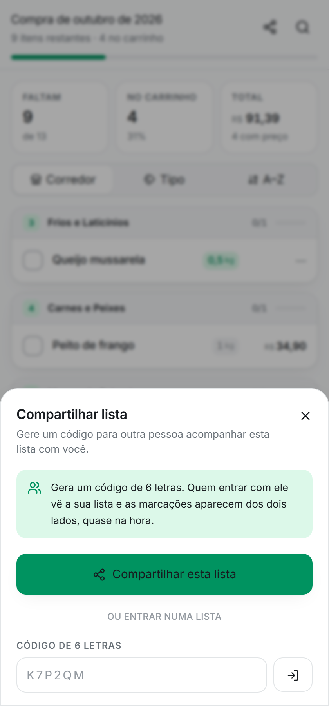
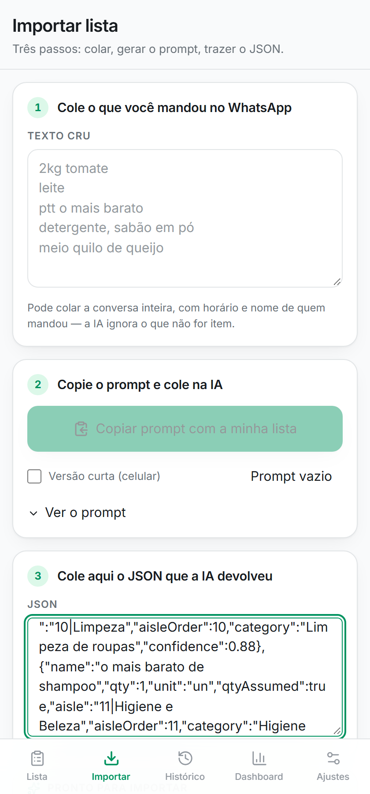
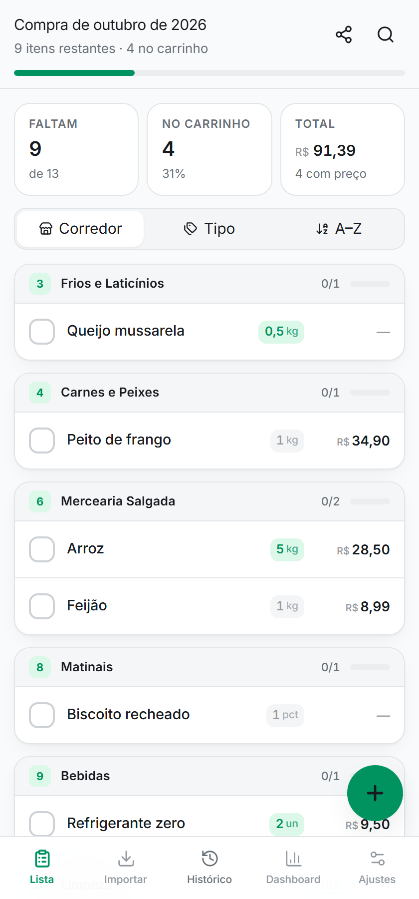
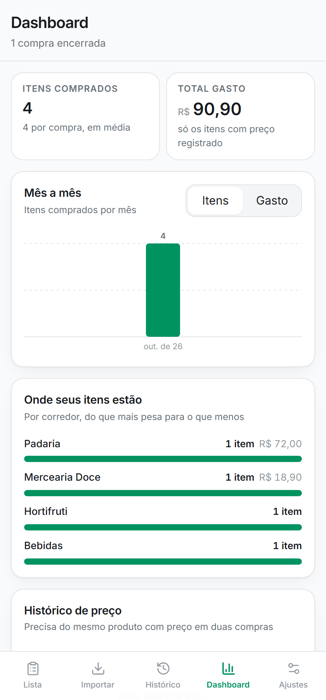
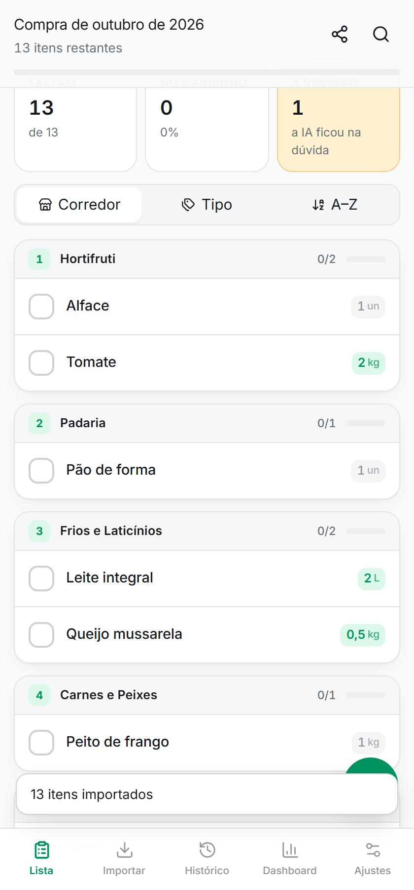
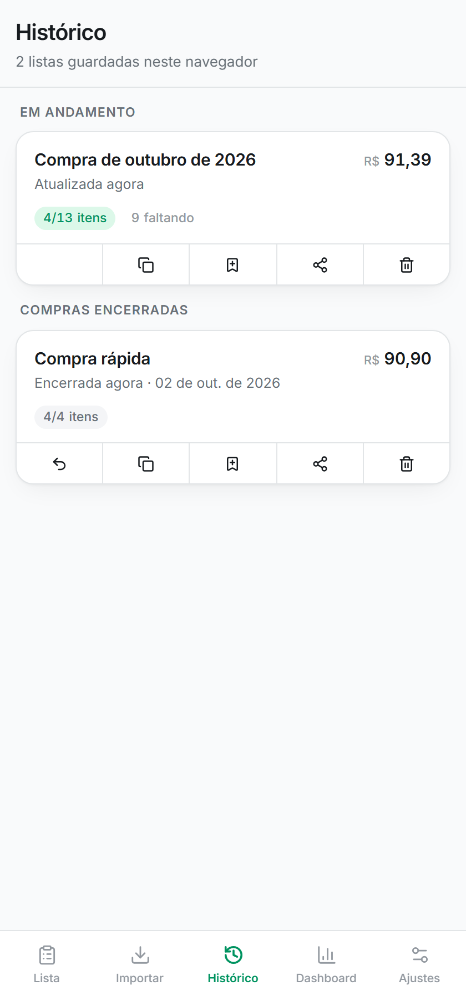
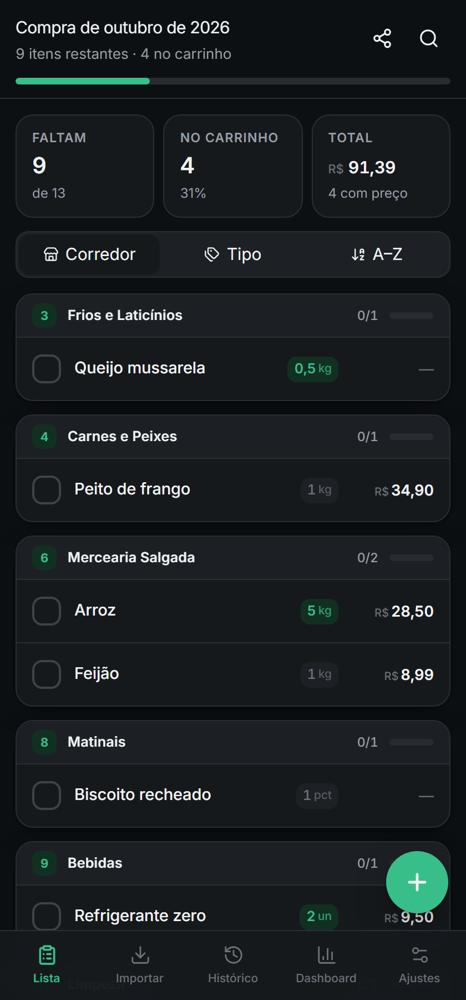

# ZapLista

Marca de um lado, aparece do outro na hora. Compartilha a lista com quem for
com você no mercado — cada um num corredor, as marcações sincronizam em
tempo real. E a lista nasce sozinha: cola a conversa do WhatsApp, a IA
organiza por corredor, você só confere.

Roda no navegador, instala como app (PWA), sem conta e sem backend próprio —
o compartilhamento em tempo real fala direto com o Supabase pelo client SDK.


## Funcionalidades

### Compra em dupla, em tempo real
Compartilha a lista com um código de 6 letras (ou QR code / link) — sem
cadastro, sem app separado. Quem entra com o código vê a mesma lista, e os
itens marcados aparecem dos dois lados quase na hora, via Supabase Realtime.
Cada um pode estar num corredor diferente do mercado marcando itens ao mesmo
tempo sem pisar no risco do outro: o merge resolve conflito por item, não por
lista inteira. Funciona offline também — continua gravando local e
sincroniza assim que a conexão volta.

### Importar do WhatsApp
Cola a conversa inteira (com hora e nome de quem mandou) e copia um prompt
pronto, já com a sua lista embutida, para colar direto numa IA. O import é
tolerante: aceita JSON com texto em volta, aspas erradas, vírgula sobrando ou
resposta cortada — nunca recusa o arquivo, corrige o que dá e avisa o resto.
Antes de aplicar, mostra um preview com quantos itens vieram, quantos
precisam de revisão e quantos já estão na lista, com opção de mesclar,
substituir ou criar uma lista nova.

### Lista organizada do seu jeito
Agrupa por corredor, por tipo ou A–Z — a ordem dos corredores segue o
percurso de um mercado típico, então ordenar por corredor é dar uma volta só
na loja. Item marcado sempre desce para o fim do grupo, grupo 100% completo
desce para o fim da lista, e os concluídos ficam numa seção colapsável.
Quantidade com stepper rápido por item.

### Preço, histórico e dashboard
Preço é opcional (desligado por padrão, o fluxo principal é só marcar o
item). Quando ligado, mostra o total da compra e compara com a última vez
que você comprou aquele item. O histórico guarda compras anteriores, deixa
duplicar uma lista inteira ("comprar de novo") e alimenta um dashboard com
gasto por mês e por corredor.

### Feito para o mercado
Modo mercado: tela de alto contraste, fonte maior, tela sempre acesa. Instala
como app na tela inicial (PWA). Backup/restore em JSON e tema claro/escuro.

## Prints

<table>
<tr>
<td width="25%"><br/><sub>Compra em dupla — código, link e QR, sincronizado em tempo real</sub></td>
<td width="25%"><br/><sub>Importar — cola o JSON da IA e revisa antes de aplicar</sub></td>
<td width="25%"><br/><sub>Lista por corredor, com preço e total</sub></td>
<td width="25%"><br/><sub>Dashboard de gasto e histórico</sub></td>
</tr>
<tr>
<td width="25%"><br/><sub>Lista recém-importada</sub></td>
<td width="25%"><br/><sub>Histórico de compras</sub></td>
<td width="25%"><br/><sub>Tema escuro</sub></td>
<td width="25%"></td>
</tr>
</table>

## Como se usa

1. **Importar** → cola o texto cru do WhatsApp.
2. Toca em **"Copiar prompt com a minha lista"**.
3. Cola na IA, copia o JSON que ela devolve.
4. Cola o JSON de volta no app. Revisa o preview e confirma.
5. (Opcional) **Compartilhar** → gera o código e manda para quem for com você.

O prompt usado também está disponível em [prompt-ia.md](prompt-ia.md), para
quem quiser usar sem abrir o app.

## Rodar o projeto

```bash
npm install
npm run dev
```

Abre em `http://localhost:5173`. O dev server escuta na rede local, então
`http://<seu-ip>:5173` abre no celular — que é onde o app é usado.

```bash
npm run build       # typecheck + build de produção em dist/
npm run typecheck   # só o typecheck
```

Deploy é a pasta `dist/` em qualquer host estático (Vercel, Netlify,
Cloudflare Pages). Para o compartilhamento em tempo real funcionar, defina
`VITE_SUPABASE_URL` e `VITE_SUPABASE_ANON_KEY` (veja `.env.example`) — sem
elas, o app funciona normalmente, só sem essa função.

## Parte técnica

| Camada | Escolha |
|---|---|
| Build | Vite |
| UI | React + TypeScript |
| Estilo | Tailwind CSS v4 (tokens via `@theme`) |
| Componentes | Radix UI (headless, acessibilidade pronta) |
| Estado | Zustand + `persist` (localStorage) |
| Validação | Zod (valida e conserta o JSON da IA) |
| Ícones | Lucide React |
| Roteamento | React Router |
| PWA | vite-plugin-pwa |
| Compartilhamento em tempo real | Supabase (Postgres + Realtime, só client SDK) |

**A IA é a dona da análise.** O app não tem parser de linguagem natural — ele
valida o JSON, encaixa na taxonomia e consome. **A taxonomia é fonte única**
([`src/lib/taxonomy.ts`](src/lib/taxonomy.ts)): alimenta o prompt, o schema de
validação e a UI ao mesmo tempo, então adicionar um corredor não duplica nada
à mão.

**Sincronização sem servidor próprio.** O compartilhamento não envia a lista
inteira a cada mudança: envia o estado e resolve conflito por item,
comparando `updatedAt` (last-write-wins). RLS fica ligada no Supabase e o
acesso passa por RPCs (`list_create` / `list_get` / `list_push`) — a chave
anônima nunca lê a tabela direto. Detalhes e SQL completo em
[SUPABASE.md](SUPABASE.md).

### Estrutura

```
src/
├── lib/
│   ├── taxonomy.ts    corredores + tipos + unidades (fonte única)
│   ├── prompt.ts      prompt gerado a partir da taxonomy
│   ├── parse.ts       extração tolerante do JSON da IA
│   ├── schema.ts      validação Zod + normalização com fallback
│   ├── merge.ts       mesclar import; merge remoto last-write-wins
│   ├── share.ts       RPCs do Supabase (criar / entrar / enviar)
│   ├── sort.ts        agrupamento, ordenação, estatísticas
│   ├── history.ts     índice por produto + agregações do dashboard
│   └── format.ts      moeda, quantidade, datas (pt-BR)
├── hooks/
│   └── useShareSync.ts   canal realtime + push com debounce
├── store/             zustand + persist (localStorage)
├── components/
│   ├── ui/            design system
│   ├── list/          ItemRow, GroupHeader, steppers, ShareSheet
│   └── dash/          gráficos em SVG inline
└── pages/             ListaAtiva, Importar, Historico, Dashboard, Config
```

## Documentos

| Arquivo | O que tem |
|---|---|
| [PLANO.md](PLANO.md) | Planejamento completo: taxonomia, modelo de dados, design system, fases |
| [prompt-ia.md](prompt-ia.md) | O prompt pronto para copiar, com notas de engenharia de prompt |
| [SUPABASE.md](SUPABASE.md) | SQL, RLS, Realtime e checklist do compartilhamento |

## Estado

Implementado: importação, lista com as três ordenações, check, quantidade,
revisão de itens de baixa confiança, histórico, duplicar lista, dashboard,
preço opcional com comparação, compartilhamento em tempo real, backup/
restore, tema claro/escuro, modo mercado.

Falta: service worker (offline completo) e ordem de corredor customizada por
mercado.
